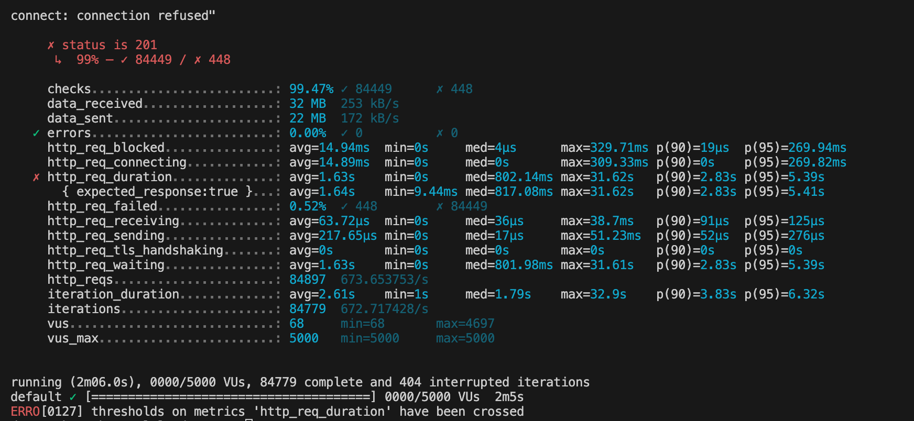
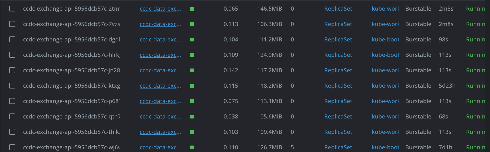

### Load Test for Pod Scaling and Performance Metrics

## Introduction

This document describes the process of conducting a load test to evaluate the scaling of pods, request per second (req/sec), latency stability, and error rate. The goal is to ensure that the system can handle the expected load while maintaining performance and reliability.

## Prerequisites

- Kubernetes cluster
- Load testing tool (e.g., Apache JMeter, Locust)
- Access to the application endpoint

## Setup

1. **Deploy the Application**: Ensure your application is deployed on the Kubernetes cluster.
2. **Install Load Testing Tool**: Install the load testing tool of your choice on your local machine or a dedicated testing environment.

## Running the Test




1. ทดสอบ Local-Report

```javascript
  npm run test:local
```

2. ทดสอบ Cloud-Report

```javascript
  npm run test:prod
```
